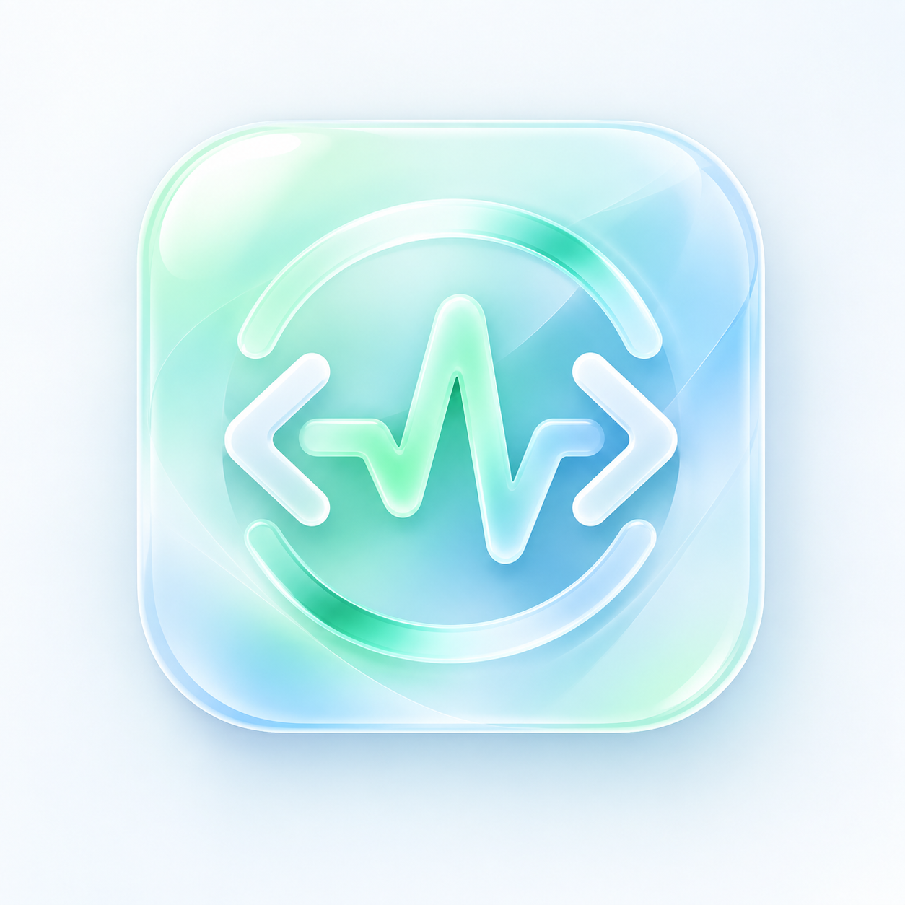
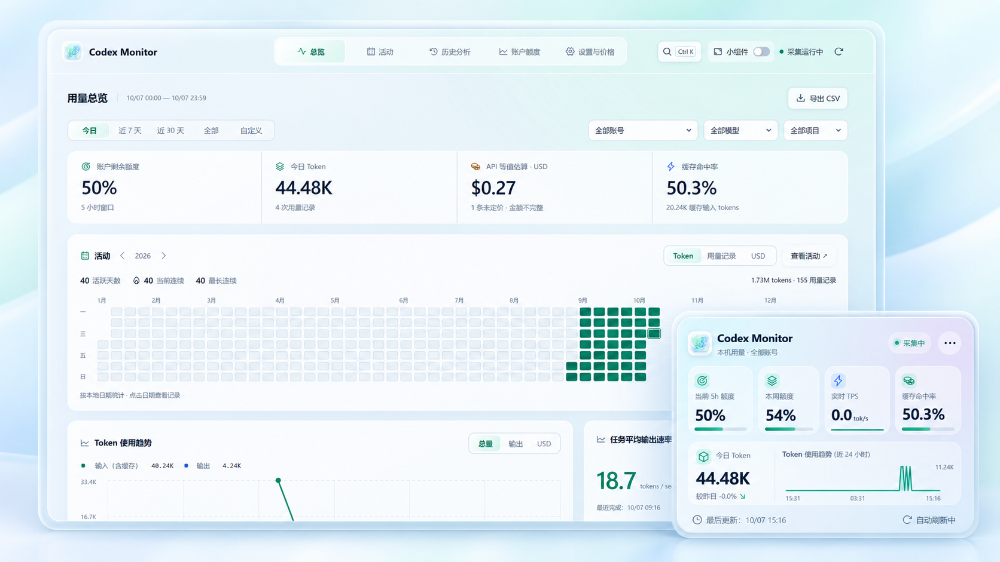
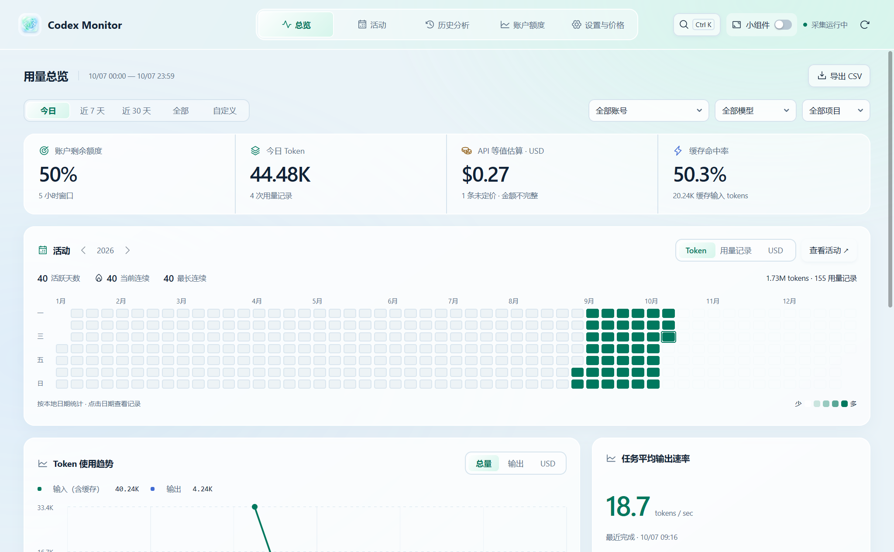
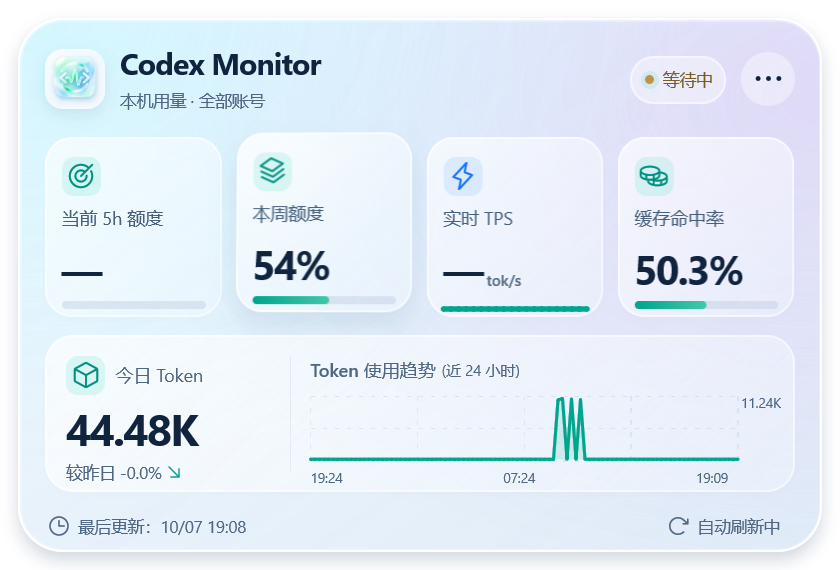

<a id="top"></a>

<div align="center">
  
  <h1>Codex Monitor</h1>
  <p><strong>本机 Codex 用量与额度，一眼看清。</strong></p>
  <p>Token 消耗 · 活动日历 · 任务记录 · 5h / 每周额度 · 桌面小窗口</p>
  <p>
    <a href="https://github.com/oysterhyd/codex-monitor/releases/latest"></a>
    
    <a href="https://mygo.egoist.dev/docs"></a>
    
    
  </p>
  <p>
    <a href="https://github.com/oysterhyd/codex-monitor/releases/latest">下载</a> ·
    <a href="#功能">功能</a> ·
    <a href="#界面预览">界面预览</a> ·
    <a href="#快速开始">快速开始</a> ·
    <a href="#开发与构建">开发与构建</a> ·
    <a href="#指标口径">指标口径</a> ·
    <a href="#数据与隐私">数据与隐私</a> ·
    <a href="docs/architecture.md">架构说明</a>
  </p>
</div>

<p align="center">
  
</p>

<p align="center"><sub>封面基于当前界面截图制作；截图使用演示数据。原始界面预览见下方。</sub></p>

<a id="功能"></a>

## 功能

Codex Monitor 是 Windows x64 本机监测工具。主窗口使用 **MyGO native UI**；日志采集、账号归属、统计、价格和 SQLite 数据层全部运行在 **Go** 中。透明小窗口保留原有 Electron / React 界面，共用 Go 服务。

| 页面 / 模式 | 能看到什么 |
| --- | --- |
| 用量总览 | Token、请求次数、缓存命中率、费用估算、使用趋势及模型 / 项目排行 |
| 活动日历 | 年度热力图、活跃天数、连续活动、小时分布与单日详情 |
| 历史分析 | 任务记录、模型 / 项目 / 会话筛选、搜索、分页、明细与 CSV 导出 |
| 账户额度 | 当前 Codex 账号的 5h / 每周额度、重置时间和离散采样曲线 |
| 设置与价格 | 中英文、主题、提醒、开机启动、账号名称与价格版本 |
| 桌面小窗口 | 玻璃卡片与 Token 圆球、拖动、置顶、用量趋势和位置恢复 |

支持今日、近 7 天、近 30 天、全部和自定义时间范围。标准 Windows 标题栏保留拖动、缩放、最小化和最大化；关闭窗口后继续在托盘采集，完全退出请使用托盘菜单。

页面、筛选、数字和图表具有过渡反馈，小窗口保留卡片 / 圆球动画与鼠标高光。两种界面均遵循系统减少动态效果设置。

| 快捷键 | 操作 |
| --- | --- |
| `Ctrl+K` | 打开命令面板 |
| `Alt+1`–`Alt+5` | 切换五个页面 |
| `Ctrl+R` | 刷新 |
| `Ctrl+E` | 导出当前筛选 |

<a id="界面预览"></a>

## 界面预览

下面是当前版本实际绘制的界面，均使用合成演示数据。

<details>
<summary><strong>原生主窗口 · 用量总览</strong></summary>

<p align="center">
  
</p>

</details>

<p align="center">
  
</p>

小窗口用量汇总本机全部账号，额度仅显示当前 Codex 账号。点击右上角三点收起为圆球，点击圆球展开；右键可设置置顶，双击标题或点击标志返回主窗口。

<a id="快速开始"></a>

## 快速开始

[下载 Windows x64 安装包](https://github.com/oysterhyd/codex-monitor/releases/download/v2.5.0/Codex-Monitor-Setup-2.5.0.exe) · [版本说明与 SHA-256 校验](https://github.com/oysterhyd/codex-monitor/releases/tag/v2.5.0)

运行 `Codex-Monitor-Setup-2.5.0.exe`，按向导选择安装目录。默认安装到 `%LOCALAPPDATA%\Programs\Codex Monitor`，无需管理员权限，并创建桌面和开始菜单快捷方式。

安装包包含 native 主程序和小窗口运行时，使用时无需安装 Go 或 Node.js。实时数据需要本机已有 Codex 安装及登录状态。更新前请从托盘完全退出应用；安装和卸载均保留 `%APPDATA%\codex-monitor` 中的统计与设置。

<details>
<summary><strong>从源码运行或构建便携目录</strong></summary>

需要 **Windows x64、Go 1.27.1、Node.js 22.19+ 和 npm**。实时数据需要本机已有 Codex 安装及登录状态。

```powershell
git clone https://github.com/oysterhyd/codex-monitor.git
cd codex-monitor
npm ci
npm start
```

`npm start` 会构建并启动当前 native 版本。首次启动读取本机日志，随后增量更新；无需输入 API Key。

只构建运行目录：

```powershell
npm run build
```

产物位于 `build/native/`，入口为 `Codex Monitor Native.exe`。**分发时复制整个目录**，保留 `widget/` 与 `icon.ico`；运行无需另装 Node.js，小窗口使用随包提供的 Electron 运行时。

可将完整目录放到 `%LOCALAPPDATA%\Programs\Codex Monitor`，为 native 可执行文件创建桌面或开始菜单快捷方式。更新前先从托盘完全退出，用户数据保存在独立目录。

</details>

<a id="开发与构建"></a>

## 开发与构建

Go 可通过 PATH 查找，也支持 `%LOCALAPPDATA%\Programs\go\bin\go.exe` 或 `GO_EXE`。

| 命令 | 用途 |
| --- | --- |
| `npm start` | 构建并启动 native 应用 |
| `npm run build` | 构建完整 native 运行目录 |
| `npm run package` | 构建 native NSIS 安装包及 SHA-256 校验文件 |
| `npm run package:check` | 隔离验证安装、升级、快捷方式、注册信息和卸载 |
| `npm test` | Go 数据 / 界面测试与小窗口刷新测试 |
| `npm run native:check` | 五页、过渡帧、窗口控制与小窗口通信验收 |
| `npm run widget:check` | 真实小窗口布局、圆球动画、拖动和错误状态验收 |
| `npm run test:ui` | 执行两项 UI 验收 |
| `npm run widget:build` | 仅构建小窗口前端 |
| `npm run dev` | 小窗口 Vite 调试页面；数据需要 Electron bridge |

测试使用 Go 生成的合成数据和临时目录。`artifacts/`、`build/`、`dist/`、依赖和数据库均被 Git 忽略；源码结构见 [架构说明](docs/architecture.md)。

制作安装包另需 **NSIS 3 与 Unicode nsProcess 插件**。可使用 PATH 中的 `makensis.exe`，或通过 `MAKENSIS` / `NSIS_PLUGIN_DIR` 指定编译器与插件目录；脚本也会识别已有 electron-builder 的 NSIS 缓存。产物为 `release/Codex-Monitor-Setup-<版本>.exe` 和 `SHA256SUMS-<版本>.txt`，打包不依赖 electron-builder。

<a id="指标口径"></a>

## 指标口径

- **用量来源**：只读扫描 `%CODEX_HOME%`（默认 `%USERPROFILE%\.codex`）的 `sessions/` 与 `archived_sessions/`，仅计入 `Codex Desktop` 来源。新版按响应 ID 去重，旧累计记录采用差分。
- **pi 来源**：支持可识别的官方 Codex 登录来源。默认读取 `%USERPROFILE%\.pi\agent\sessions`，兼容 `openai-codex`，以及能通过当前本机官方 OAuth 配置识别的 `openai`。未知账号保持未归属；混用登录方式的历史日志需结合实际情况判断。
- **额度**：通过本机 Codex app-server 的 `account/rateLimits/read` 查询，属于当前账号，可能包括其他设备的用量。曲线在重置和采样空档处断开。
- **缓存命中率**：缓存输入 / 输入 Token；没有输入时保持未知。
- **实时 TPS**：最近 60 秒日志中的输出 Token / 60，包含等待时间。
- **费用**：按生效时间选择价格版本，显示 API 等值 USD 估算；不是订阅实付账单，未定价记录会明确标注。

近期日志每 3 秒增量扫描，全部目录每 60 秒校验；额度查询间隔可设为 60 / 120 / 300 秒。

<a id="数据与隐私"></a>

## 数据与隐私

统计和设置默认保存在 `%APPDATA%\codex-monitor`，不写入 Codex / pi 原始文件。不保存对话正文、工具调用、认证 token 或 API key；账号使用身份字段的 SHA-256 摘要。无遥测、无跨设备同步，不创建模型请求。

| 文件 / 目录 | 用途 |
| --- | --- |
| `monitor.sqlite` | Go 服务的统计、价格、账号和设置 |
| `monitor.sqlite-wal` / `monitor.sqlite-shm` | SQLite 运行文件 |
| `monitor-owner.json` | 数据库单进程所有权锁 |
| `widget-window.json` | 小窗口的位置、置顶和模式 |
| `native-shell/` | MyGO 窗口状态 |

已有数据库先以只读方式检查完整性，失败时显示启动错误并拒绝写入。清空历史保留价格和设置，并设置日志重放边界。

<details>
<summary>自定义目录与隔离运行</summary>

- `--data` / `MONITOR_TEST_DATA`：监测数据目录。
- `--home` / `MONITOR_CODEX_HOME`：Codex 来源目录。
- `--offline`：禁止自动扫描和额度查询。
- `PI_CODING_AGENT_DIR` / `PI_CODING_AGENT_SESSION_DIR`：pi 目录。
- `MONITOR_PI_HOME` / `MONITOR_PI_SESSIONS`：监测专用 pi 目录覆盖。

</details>

## 参考

- [MyGO 文档](https://mygo.egoist.dev/docs)
- [Codex App Server 协议](https://learn.chatgpt.com/docs/app-server)
- [OpenAI API 价格](https://developers.openai.com/api/docs/pricing)

<p align="center"><a href="#top">返回顶部 ↑</a></p>
