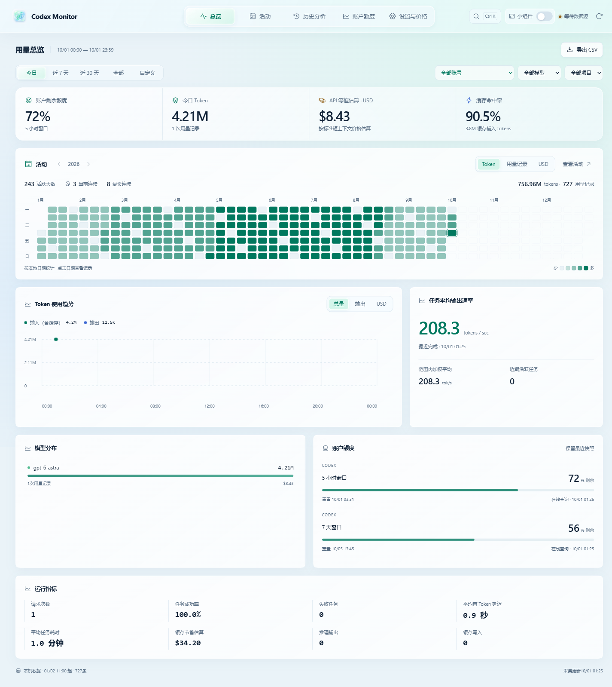
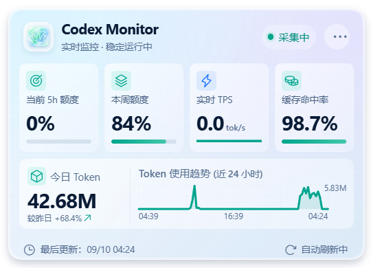
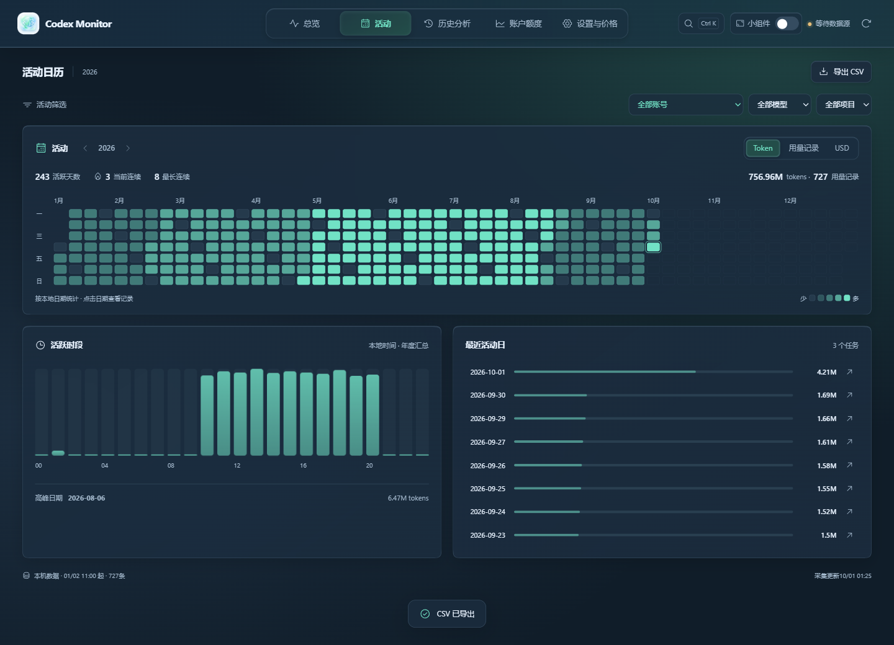

<div align="center">
  
  <h1>Codex Monitor</h1>
  <p><b>Windows desktop app for monitoring local Codex usage and quotas</b></p>
  <p>Token usage · Activity heatmap · Task records · 5h / weekly quotas · Glass interface and desktop widget</p>
  <p>
    <a href="https://github.com/oysterhyd/codex-monitor/releases/latest"></a>
    <a href="https://github.com/oysterhyd/codex-monitor/releases/latest"></a>
  </p>
  <p>简体中文 / English</p>
</div>

<p align="center">
  
</p>
<p align="center"><small>The overview and activity previews use demonstration data.</small></p>
<p align="center">
  
</p>

## Download

[Download for Windows x64](https://github.com/oysterhyd/codex-monitor/releases/latest)

Run the `Codex-Monitor-Setup-*.exe` installer. It installs per-user (no admin rights) and can upgrade an existing copy. Closing the window keeps monitoring active in the system tray; use **Quit / 退出** to exit fully.

The installer is unsigned. Automatic updates and cross-device synchronization are not included.

## Features

### Overview
Token usage, API-equivalent estimated cost, cache hit rate, remaining quota, model distribution, and output speed. Time ranges: today / last 7 days / last 30 days / all / custom, filterable by model, project, task, and account. Custom dates apply on confirmation, active filters appear as removable chips, and the trend switches between total tokens, output, and USD. Chart samples can be inspected with the keyboard.

### Activity calendar
A yearly heatmap of real local usage, with year selection and token / usage-record / USD views. Explore active days, current and longest streaks, hourly activity, and recent active dates. Select a day to inspect its totals and open that day's task records. Account, model, and project filters apply to the calendar, and CSV export covers the selected year. Future dates are disabled and unpriced costs remain unknown.



### History
Search and sort usage breakdowns by model, project, and task. Task records support task / project / model search, status filters, newest / oldest order, pagination, and expandable per-model token and cost details. CSV export follows record search and status filters, including literal special characters and international project names. Formula-like CSV values are escaped.

### Quota
Current-account 5h and weekly quota windows: remaining percentage, reset time, update time, and a step-chart history that preserves real sample boundaries and stays broken across resets.

### Settings
Settings are grouped into General, Accounts, Model pricing, and Data & storage. Switch Chinese/English instantly, choose system / light / dark appearance, configure launch at sign-in and quota alerts, inspect data locations, and manage account names. Model prices retain effective dates and support adding, editing, and deleting manual versions.

### Interaction and shortcuts
The glass gradients and top navigation remain, with a compact metric strip, clearer grouping, and motion for navigation, filters, charts, value changes, expanded details, and notifications. System reduced-motion settings are respected. `Ctrl+K` opens the command palette to find pages, models, or projects; `Alt+1`–`Alt+5` switch pages, `Ctrl+R` refreshes, and `Ctrl+E` exports. Visible windows receive collection updates immediately, and the interface can reload independently after a rendering failure.

### Desktop widget
- Left-click the top-right dots to smoothly collapse the 560×380 card into a today-token orb; click the orb to expand. Right-click opens options.
- Pointer-following highlights, gentle card tilt, hover elevation, and press feedback bring the glass surface to life.
- A top-bar switch toggles between the main window and the glass desktop card; the tray menu offers the same checkbox.
- The card shows 5h / weekly remaining quota, live TPS, cache hit rate, today's tokens, and a 24-hour usage trend.
- Pinned above other windows by default; unpin from the card menu at any time.
- In widget mode the card owns the taskbar slot, so the taskbar always offers an entry point; clicking it summons the widget.
- Drag to move, double-click the header to return. Mode, position, and pin state persist locally across restarts.
- Smooth enter/exit transitions respect the system reduced-motion setting. The translucent glass look is a Windows/CSS approximation, not Apple's native material.

### Tray and background
Closing the window keeps incremental collection running in the tray with open / refresh / mute / quit actions. Windows notifications fire at 20% and 10% remaining quota (once per cycle and threshold); launch at sign-in is optional and starts silently.

## How it works

- Read-only scanning of `%CODEX_HOME%` (default `%USERPROFILE%\.codex`) `sessions/` and `archived_sessions/`. Only `originator === "Codex Desktop"` records are counted (including desktop subagents); CLI and IDE-extension sessions are excluded.
- New-format usage records are deduplicated by `response_id`; legacy `token_count` snapshots use cumulative differencing.
- Quotas are read through the local Codex app-server (`account/rateLimits/read`) — no model requests are created and no Codex files are modified.
- Recent files are scanned every 3 seconds and all directories re-checked every 60 seconds; the quota query interval is configurable between 60–300 seconds.
- Statistics live in `%APPDATA%\codex-monitor\monitor.sqlite`, managed by a background worker with automatic recovery; a corrupt database is backed up and rebuilt while readable settings and prices are kept.

## Metrics and privacy

- Quota belongs to the currently signed-in account and may include usage from other devices. Token statistics cover locally available Codex Desktop records only.
- Cache hit rate = cached input tokens ÷ input tokens (token-weighted); no fake 0% is shown when there is no input.
- API-equivalent cost is an estimate using Standard short-context API rates — not a subscription bill. Fast, long-context, and regional adjustments are not recognized; default prices ship for major models, other models can be priced manually as new versions.
- Live TPS divides output tokens recorded in the last 60 seconds by 60, including idle time; it is not exact generation throughput. History shows the per-task average output rate.
- Only statistical records are parsed; message and tool bodies are never stored. Credentials stay local. Accounts are identified by a SHA-256 digest of the login user and account pair — no passwords, tokens, or API keys are saved.
- All data stays on the local computer. No telemetry, no sync. Clearing history keeps prices and settings.

## Build from source

Requires Windows, Node.js 22.19+ with `node:sqlite` support, npm, and a local Codex installation for live data.

```powershell
npm ci
npm run build
npm start
npm run package
```

Built installers are written to `release/`. Browser-only development (`npm run dev`) previews the shell without connecting to local account data.

## Stack

Electron 44 · React 19 · Vite 8 · SQLite (node:sqlite) · Phosphor Icons

## Reference

- [Codex App Server protocol](https://learn.chatgpt.com/docs/app-server)
- [OpenAI API pricing](https://developers.openai.com/api/docs/pricing)
